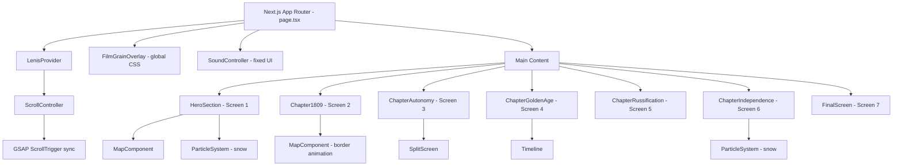

# Design Document

## Finland History Presentation — «Великое княжество Финляндское (1809–1917)»

---

## Overview

Сайт представляет собой одностраничное кинематографическое storytelling-приложение, построенное на Next.js (App Router). Пользователь прокручивает страницу сверху вниз и последовательно проходит через семь полноэкранных глав. Каждая глава — это отдельный «кадр» документального фильма с собственной атмосферой, цветовой палитрой и анимациями.

**Ключевые технические решения:**

- **Lenis** управляет плавной прокруткой (lerp ≥ 0.8) и передаёт позицию скролла в GSAP.
- **GSAP + ScrollTrigger** управляет сложными scroll-triggered анимациями: параллакс, timeline-анимации, glitch-переходы.
- **Framer Motion** управляет компонентными анимациями: fade-in при входе в viewport, stagger-появление иконок, hover-эффекты.
- **TailwindCSS** обеспечивает адаптивную вёрстку и базовые стили.
- **Canvas API** (кастомный хук) реализует систему снежных частиц.
- **Web Audio API** управляет фоновым звуком через `<audio>` элемент.

**Разделение ответственности между анимационными библиотеками:**

| Задача | Инструмент |
|---|---|
| Плавная прокрутка | Lenis |
| Scroll-triggered параллакс, сложные timeline | GSAP + ScrollTrigger |
| Fade-in при входе в viewport, stagger, hover | Framer Motion |
| Glitch-переход, кинематографический zoom | GSAP |
| Частицы (снег) | Canvas API (кастомный хук) |
| Звук | Web Audio API / HTMLAudioElement |

---

## Architecture



**Структура файлов:**

```
src/
├── app/
│   ├── layout.tsx          # Root layout: FilmGrainOverlay, LenisProvider
│   ├── page.tsx            # Главная страница: все 7 экранов
│   └── globals.css         # Базовые стили, film grain CSS, шрифты
├── components/
│   ├── providers/
│   │   └── LenisProvider.tsx
│   ├── layout/
│   │   ├── FilmGrainOverlay.tsx
│   │   └── SoundController.tsx
│   ├── sections/
│   │   ├── HeroSection.tsx
│   │   ├── Chapter1809.tsx
│   │   ├── ChapterAutonomy.tsx
│   │   ├── ChapterGoldenAge.tsx
│   │   ├── ChapterRussification.tsx
│   │   ├── ChapterIndependence.tsx
│   │   └── FinalScreen.tsx
│   ├── ui/
│   │   ├── MapComponent.tsx
│   │   ├── ParticleSystem.tsx
│   │   ├── SplitScreen.tsx
│   │   ├── Timeline.tsx
│   │   ├── ParallaxLayer.tsx
│   │   └── ScrollIndicator.tsx
│   └── animations/
│       ├── FadeInView.tsx      # Framer Motion wrapper
│       └── StaggerReveal.tsx   # Framer Motion stagger wrapper
├── hooks/
│   ├── useLenis.ts
│   ├── useParticles.ts
│   └── useSound.ts
└── lib/
    ├── gsap.ts             # GSAP + ScrollTrigger registration
    └── constants.ts        # Цвета, тайминги, конфигурация
```

---

## Components and Interfaces

### LenisProvider

Инициализирует Lenis при монтировании, синхронизирует с GSAP ticker, предоставляет инстанс через React Context.

```typescript
interface LenisContextValue {
  lenis: Lenis | null;
}

// Инициализация
const lenis = new Lenis({
  lerp: 0.08,          // ~0.8 в нормализованном виде Lenis v2
  smoothWheel: true,
  touchMultiplier: 2,
});

// Синхронизация с GSAP
gsap.ticker.add((time) => {
  lenis.raf(time * 1000);
});
gsap.ticker.lagSmoothing(0);

// ScrollTrigger proxy
ScrollTrigger.scrollerProxy(document.body, {
  scrollTop(value) {
    if (arguments.length) lenis.scrollTo(value as number);
    return lenis.scroll;
  },
  getBoundingClientRect() {
    return { top: 0, left: 0, width: window.innerWidth, height: window.innerHeight };
  },
});
lenis.on('scroll', ScrollTrigger.update);
```

### ScrollController (хук useLenis)

```typescript
interface UseLenisReturn {
  lenis: Lenis | null;
  scrollY: number;        // текущая позиция скролла
  scrollProgress: number; // 0–1 прогресс по всей странице
}
```

### FilmGrainOverlay

Глобальный CSS-оверлей с эффектом зерна плёнки. Реализован через SVG `<feTurbulence>` фильтр и CSS-анимацию смещения, наложенный поверх всего контента с `pointer-events: none`.

```typescript
// Компонент — просто div с фиксированным позиционированием
// Вся логика — в CSS/Tailwind
interface FilmGrainOverlayProps {
  opacity?: number; // default: 0.035
}
```

### SoundController

```typescript
interface SoundControllerState {
  isPlaying: boolean;
  volume: number; // 0–1
}

interface SoundControllerProps {
  src: string;           // путь к аудиофайлу
  fadeInDuration?: number;  // мс, default: 1000
  fadeOutDuration?: number; // мс, default: 1000
}
```

Фиксированная позиция (fixed, top-right). Использует `HTMLAudioElement` с плавным изменением `volume` через `requestAnimationFrame`. По умолчанию — `isPlaying: false`.

### MapComponent

```typescript
interface MapComponentProps {
  variant: 'hero' | 'transition-1809';
  // 'hero' — статичная карта с zoom-анимацией
  // 'transition-1809' — анимация смены границ Финляндии
  className?: string;
}
```

Реализован как SVG-карта Европы начала XIX века. Для `transition-1809` — GSAP анимирует `fill` и `stroke` финской территории (от шведских цветов к российским). Zoom в hero — GSAP `scale` transform.

### ParticleSystem

```typescript
interface ParticleSystemProps {
  count?: number;          // default: 100, max: 200
  mobileCount?: number;    // default: 50, max: 80
  type: 'snow' | 'fog';
  className?: string;
}
```

Canvas-based компонент. Хук `useParticles` управляет RAF-циклом и массивом частиц. Количество адаптируется к ширине viewport: `window.innerWidth < 768 ? mobileCount : count`.

```typescript
interface Particle {
  x: number;
  y: number;
  radius: number;
  speed: number;
  opacity: number;
  drift: number; // горизонтальное смещение
}
```

### SplitScreen

```typescript
interface SplitScreenProps {
  leftContent: React.ReactNode;  // символика Российской империи
  rightContent: React.ReactNode; // символы автономной Финляндии
  leftLabel: string;
  rightLabel: string;
}
```

### Timeline

```typescript
interface TimelineEvent {
  year: string;
  label: string;
  description: string;
}

interface TimelineProps {
  events: TimelineEvent[];
  activeIndex?: number; // управляется scroll position
}
```

Горизонтальная или вертикальная шкала (вертикальная на мобильных). Каждая точка — `<button>` с tooltip при hover. Активация точек — через Framer Motion `useInView` или GSAP ScrollTrigger.

### ParallaxLayer

```typescript
interface ParallaxLayerProps {
  speed: number;    // коэффициент 0.2–0.5
  children: React.ReactNode;
  className?: string;
}
```

Обёртка, использующая GSAP ScrollTrigger `scrub` для параллакс-смещения дочерних элементов.

### FadeInView / StaggerReveal

```typescript
interface FadeInViewProps {
  children: React.ReactNode;
  delay?: number;       // мс
  duration?: number;    // мс, default: 600
  direction?: 'up' | 'down' | 'left' | 'right' | 'none';
  className?: string;
}

interface StaggerRevealProps {
  children: React.ReactNode[];
  staggerDelay?: number; // мс между элементами, default: 150
  className?: string;
}
```

Framer Motion `motion.div` с `whileInView` и `viewport={{ once: true }}`.

---

## Data Models

### ChapterConfig

Конфигурация каждой главы — статические данные, не требующие API.

```typescript
interface ChapterConfig {
  id: string;
  screenNumber: number;
  title: string;
  quote: string;
  colorPalette: ChapterPalette;
  backgroundTexture?: 'paper' | 'parchment' | 'none';
  hasParallax: boolean;
  animationVariant: 'fade' | 'glitch' | 'light-burst' | 'golden';
}

interface ChapterPalette {
  background: string;   // CSS color
  text: string;
  accent: string;
  overlay?: string;     // для цветовых наложений (красный в Экране 5)
}
```

### ParticleConfig

```typescript
interface ParticleConfig {
  maxDesktop: number;   // 200
  maxMobile: number;    // 80
  minCount: number;     // 50
  mobileBreakpoint: number; // 768
}
```

### SoundConfig

```typescript
interface SoundConfig {
  src: string;
  defaultVolume: number;    // 0.4
  fadeInDuration: number;   // 1000 мс
  fadeOutDuration: number;  // 1000 мс
  autoplay: boolean;        // false
}
```

### TimelineEventData

```typescript
const TIMELINE_EVENTS: TimelineEvent[] = [
  { year: '1809', label: 'Переход к России', description: 'Фридрихсгамский мирный договор' },
  { year: '1812', label: 'Хельсинки — столица', description: 'Перенос столицы из Турку' },
  { year: '1835', label: 'Калевала', description: 'Публикация финского национального эпоса' },
  { year: '1860', label: 'Финская марка', description: 'Введение собственной валюты' },
  { year: '1863', label: 'Финский язык', description: 'Официальный статус финского языка' },
  { year: '1899', label: 'Февральский манифест', description: 'Начало русификации' },
  { year: '1904', label: 'Убийство Бобрикова', description: 'Эйген Шауман, финский националист' },
  { year: '1917', label: 'Независимость', description: '6 декабря — провозглашение независимости' },
];
```

---

## Correctness Properties

*A property is a characteristic or behavior that should hold true across all valid executions of a system — essentially, a formal statement about what the system should do. Properties serve as the bridge between human-readable specifications and machine-verifiable correctness guarantees.*

### Property 1: Particle count respects viewport constraints

*For any* viewport width, the number of simultaneously rendered snow particles SHALL be within the configured bounds: between `minCount` (50) and `maxDesktop` (200) on desktop, and not exceeding `maxMobile` (80) on viewports narrower than 768px.

**Validates: Requirements 11.3, 11.4**

---

### Property 2: Sound fade timing invariant

*For any* sequence of Sound ON / Sound OFF toggle actions, the audio volume at the end of a fade-in SHALL reach the target volume, and the volume at the end of a fade-out SHALL reach zero, regardless of how many times the toggle is activated.

**Validates: Requirements 9.2, 9.3**

---

### Property 3: Timeline events are in chronological order

*For any* rendered Timeline component, the displayed year values SHALL appear in strictly ascending chronological order from first to last event.

**Validates: Requirements 10.1**

---

### Property 4: Stagger reveal interval invariant

*For any* set of autonomy attribute icons rendered by `StaggerReveal`, the animation delay between consecutive icons SHALL not exceed 150 ms.

**Validates: Requirements 4.5**

---

## Error Handling

### Autoplay Policy (Sound)

Браузеры блокируют автовоспроизведение звука без взаимодействия пользователя. `SoundController` инициализируется в состоянии `isPlaying: false`. При попытке воспроизведения `audio.play()` возвращает Promise — ошибка `NotAllowedError` перехватывается и игнорируется без отображения UI-ошибки пользователю.

```typescript
const handlePlay = async () => {
  try {
    await audioRef.current.play();
    setIsPlaying(true);
  } catch (error) {
    if (error instanceof DOMException && error.name === 'NotAllowedError') {
      // Браузер заблокировал автовоспроизведение — сохраняем состояние OFF
      setIsPlaying(false);
    }
  }
};
```

### GSAP / Lenis на мобильных устройствах

На мобильных устройствах Lenis может конфликтовать с нативным touch-скроллом. Решение: `touchAction: 'none'` на wrapper-элементе при активном Lenis, с fallback на нативный скролл при обнаружении проблем производительности через `PerformanceObserver`.

### Lazy Loading и отсутствие изображений

Все изображения используют `next/image` с `loading="lazy"` и обязательным `alt`. При недоступности изображения — CSS-градиентный placeholder сохраняет визуальную структуру главы.

### SSR / Hydration

GSAP, Lenis и Canvas API — браузерные API. Все компоненты, использующие их, помечены директивой `'use client'`. `LenisProvider` инициализируется только в `useEffect` (после монтирования). `ParticleSystem` рендерит `null` на сервере.

### Производительность анимаций

На мобильных устройствах (определяется через `window.matchMedia('(max-width: 768px)')`) применяется `prefers-reduced-motion` media query и упрощённые варианты анимаций: отключаются glitch-переходы, параллакс, уменьшается количество частиц.

```typescript
const prefersReducedMotion = window.matchMedia(
  '(prefers-reduced-motion: reduce)'
).matches;
```

---

## Testing Strategy

### Применимость Property-Based Testing

Данный проект — кинематографический UI-сайт. Большинство требований касаются визуального рендеринга, анимаций и UX-поведения, которые не поддаются property-based тестированию. Однако ряд логических инвариантов (конфигурация частиц, тайминги, порядок данных) поддаётся формальной проверке.

**PBT применяется для:** логики `ParticleSystem` (подсчёт частиц), логики `SoundController` (fade-тайминги), порядка данных `Timeline`.

**PBT не применяется для:** визуального рендеринга компонентов, CSS-анимаций, GSAP/Framer Motion эффектов, интеграции с браузерными API.

### Property-Based Tests

Библиотека: **fast-check** (TypeScript-совместимая, активно поддерживается).

Каждый тест запускается минимум **100 итераций**.

#### Property 1: Particle count respects viewport constraints

```typescript
// Feature: finland-history-presentation, Property 1: particle count respects viewport constraints
it('particle count stays within bounds for any viewport width', () => {
  fc.assert(
    fc.property(
      fc.integer({ min: 320, max: 2560 }), // viewport width
      fc.integer({ min: 50, max: 200 }),    // requested count
      (viewportWidth, requestedCount) => {
        const count = resolveParticleCount(requestedCount, viewportWidth);
        if (viewportWidth < 768) {
          return count <= 80 && count >= 0;
        }
        return count <= 200 && count >= 50;
      }
    ),
    { numRuns: 100 }
  );
});
```

#### Property 2: Sound fade timing invariant

```typescript
// Feature: finland-history-presentation, Property 2: sound fade timing invariant
it('volume reaches target after fade regardless of toggle sequence', () => {
  fc.assert(
    fc.property(
      fc.array(fc.boolean(), { minLength: 1, maxLength: 20 }), // toggle sequence
      fc.float({ min: 0.1, max: 1.0 }),                        // target volume
      (toggleSequence, targetVolume) => {
        const finalState = simulateSoundToggles(toggleSequence, targetVolume);
        if (finalState.isPlaying) {
          return Math.abs(finalState.volume - targetVolume) < 0.001;
        } else {
          return Math.abs(finalState.volume - 0) < 0.001;
        }
      }
    ),
    { numRuns: 100 }
  );
});
```

#### Property 3: Timeline events are in chronological order

```typescript
// Feature: finland-history-presentation, Property 3: timeline events are in chronological order
it('timeline events are always in ascending year order', () => {
  fc.assert(
    fc.property(
      fc.shuffledSubarray(TIMELINE_EVENTS, { minLength: 2 }),
      (events) => {
        const sorted = sortTimelineEvents(events);
        for (let i = 1; i < sorted.length; i++) {
          if (parseInt(sorted[i].year) < parseInt(sorted[i - 1].year)) return false;
        }
        return true;
      }
    ),
    { numRuns: 100 }
  );
});
```

#### Property 4: Stagger reveal interval invariant

```typescript
// Feature: finland-history-presentation, Property 4: stagger reveal interval invariant
it('stagger delays between icons never exceed 150ms', () => {
  fc.assert(
    fc.property(
      fc.integer({ min: 1, max: 12 }), // number of icons
      fc.integer({ min: 0, max: 150 }), // configured stagger delay
      (iconCount, staggerDelay) => {
        const delays = computeStaggerDelays(iconCount, staggerDelay);
        for (let i = 1; i < delays.length; i++) {
          if (delays[i] - delays[i - 1] > 150) return false;
        }
        return true;
      }
    ),
    { numRuns: 100 }
  );
});
```

### Unit Tests (Example-Based)

Библиотека: **Vitest** + **React Testing Library**.

| Тест | Что проверяется |
|---|---|
| `SoundController` — default state | `isPlaying === false` при монтировании |
| `SoundController` — autoplay block | Ошибка `NotAllowedError` не пробрасывается в UI |
| `FilmGrainOverlay` — render | Компонент рендерится с `pointer-events: none` |
| `Timeline` — tooltip | При hover на точку появляется описание события |
| `ScrollIndicator` — render | Отображается текст «Scroll to begin ↓» |
| `HeroSection` — structure | Содержит заголовок, подзаголовок «1809–1917», индикатор |
| `FinalScreen` — button | Кнопка «Спасибо за внимание» присутствует и кликабельна |

### Integration Tests

| Тест | Что проверяется |
|---|---|
| Lenis + GSAP sync | ScrollTrigger обновляется при событии `scroll` от Lenis |
| `ParticleSystem` — canvas init | Canvas элемент создаётся и RAF-цикл запускается |
| Responsive breakpoints | Snapshot-тесты для 320px, 768px, 1440px viewport |

### Visual / Snapshot Tests

Storybook + Chromatic (опционально) для визуальной регрессии ключевых компонентов: `HeroSection`, `SplitScreen`, `Timeline`, `FinalScreen`.

### Accessibility

- Все интерактивные элементы (`SoundController`, кнопки Timeline, финальная кнопка) имеют `aria-label`.
- `prefers-reduced-motion` media query уважается во всех анимациях.
- Цветовой контраст текста соответствует WCAG AA (минимум 4.5:1 для основного текста).
- Полная валидация требует ручного тестирования с assistive technologies.
